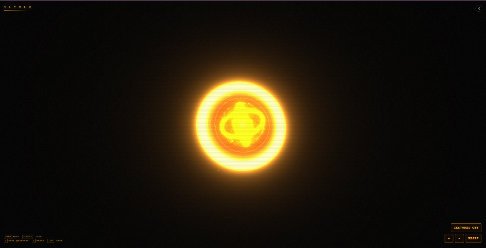
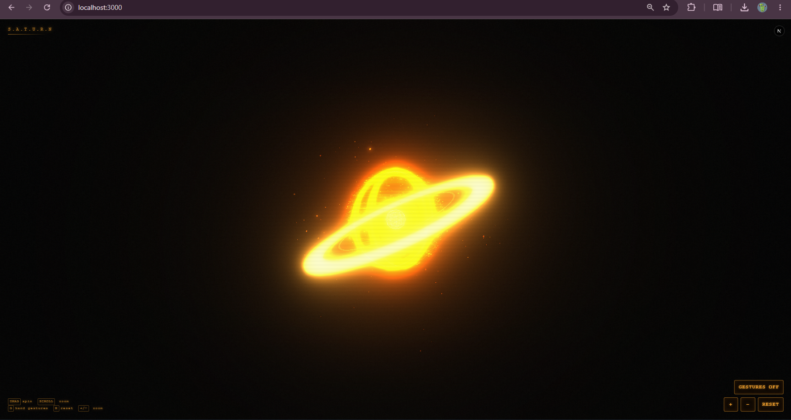

# 🪐 Saturn-AI

> 🚧 **Status:** Active Development

> A modular voice-first AI assistant featuring a real-time holographic orb inspired by the elegance and symbolism of Saturn.

<p align="center">
  
  
</p>

---

## ✨ Features

### Interface

- 🌌 Interactive 3D holographic orb
- 🪐 Saturn ring system
- 🖐️ Hand gesture controls

### AI

- 🧠 Gemini-powered reasoning
- 🎭 Custom Saturn personality
- 🧩 Brain state management
- 💬 Conversation pipeline

### Voice

- 🎤 Speech recognition
- 🪐 Local Kokoro text-to-speech
- 🗣️ Custom Saturn voice using Kokoro or Elevenlabs
- 🔊 Streaming PCM audio playback
- 🔤 Speech formatting for natural pronunciation
- 🎙️ Wake-word detection with `"Saturn"`
- 💬 Conversational voice loop
- ⏱️ Conversation timeout and automatic return to wake-word listening

### Architecture

- ⚡ Modular AI provider
- 🏗️ Next.js + TypeScript
- 🔌 Provider-based speech architecture
- 🐍 Local Python Kokoro TTS server
- 🌐 HTTP-based communication between Saturn and Kokoro
- 🧠 Centralized brain state management

---

## 🚀 Getting Started

### 1. Clone the repository

```bash
git clone https://github.com/Iba721/Saturn-AI.git
cd Saturn-AI
```

### 2. Install Node.js dependencies

```bash
npm install
```

### 3. Create a `.env.local` file

```env
SATURN_GEMINI_API_KEY=YOUR_GEMINI_API_KEY
SATURN_MODEL=gemini-3.6-flash
ELEVENLABS_API_KEY=YOUR_ELEVENLABS_API_KEY
SATURN_VOICE_ID=brtgSJjjOqKrg09MZrB8
```

> **Note:** Saturn supports both Kokoro and ElevenLabs for text-to-speech. ElevenLabs provides cloud-based TTS, while Kokoro provides a local TTS option. Kokoro was added as a local alternative after the available ElevenLabs credits were exhausted.

> ⚠️ Never commit your `.env.local` file or expose your Gemini API key publicly.

---

## 🐍 Local Kokoro TTS Setup

Saturn currently uses **Kokoro** as its local text-to-speech engine.

Kokoro runs as a separate local Python server and communicates with Saturn through:

```text
http://127.0.0.1:8765
```

### Python requirement

The current Saturn setup uses:

```text
Python 3.12
```

Python 3.14 should not be used for the current Kokoro environment because the required Kokoro package versions are not compatible with Python 3.14.

### 1. Create the Kokoro virtual environment

From the Kokoro directory:

```powershell
cd kokoro
```

Create the virtual environment using Python 3.12:

```powershell
& "C:\Users\Anant\AppData\Local\Programs\Python\Python312\python.exe" -m venv .venv
```

Activate it:

```powershell
.\.venv\Scripts\Activate.ps1
```

### 2. Install Kokoro dependencies

Install the required packages inside the virtual environment:

```powershell
python -m pip install kokoro soundfile numpy
```

> The exact dependency versions may change as the Kokoro ecosystem evolves.

### 3. Start the Kokoro server

The Kokoro server runs locally on:

```text
http://127.0.0.1:8765
```

You can start it manually with:

```powershell
cd kokoro
.\.venv\Scripts\Activate.ps1
python server.py
```

### 4. One-click Kokoro startup

Saturn includes a batch launcher for starting Kokoro without manually activating the environment every time.

Run:

```text
kokoro/start-kokoro.bat
```

The launcher starts the Python server using the Kokoro virtual environment.

A successful startup looks like:

```text
🪐 Loading Kokoro...
🪐 Kokoro ready.
🪐 Kokoro server running at http://127.0.0.1:8765
```

Keep the Kokoro server running while Saturn is running.

---

## 🎤 Voice Interaction

Saturn uses browser speech recognition for voice input.

### Wake word

The current wake word is:

```text
Saturn
```

Saturn continuously listens for the wake word while idle.

### Wake word only

You can say:

```text
Saturn
```

Saturn responds and enters command listening mode.

### Wake word + command

You can also speak the command immediately:

```text
Saturn, who are you?
```

Saturn extracts the command and sends it through the conversational pipeline.

### Conversational loop

After Saturn answers, it remains in conversational command listening for a limited period.

This allows interactions such as:

```text
You: Saturn

Saturn: Yes?

You: Who are you?

Saturn: I am Saturn...

You: What can you do?

Saturn: ...

You: Nothing
```

After the conversation ends, Saturn returns to:

```text
Wake-word listening
```

This prevents Saturn from permanently listening for commands when no conversation is active.

---

## 🔊 Local Speech Pipeline

The current local speech architecture is:

```text
User voice
     ↓
Web Speech API
     ↓
Wake-word detection
     ↓
Command extraction
     ↓
Gemini
     ↓
Saturn response
     ↓
Kokoro TTS
     ↓
Local Python server
     ↓
PCM audio stream
     ↓
Web Audio API
     ↓
Speaker
```

Kokoro generates audio locally rather than sending speech requests to a cloud TTS provider.

The Kokoro server converts generated audio into:

```text
16-bit PCM
24,000 Hz
Mono
```

and streams it to Saturn.

---

## 🧠 Brain State System

Saturn uses centralized brain states to coordinate the assistant and the holographic orb.

Current states include:

```text
idle
listening
thinking
speaking
executing
error
```

The state system allows the visual orb and voice system to respond to what Saturn is currently doing.

Example:

```text
idle
  ↓
listening
  ↓
thinking
  ↓
speaking
  ↓
idle
```

---

## 🏗️ Project Structure

```text
Saturn-AI/
│
├── app/
│   ├── api/
│   │   ├── chat/
│   │   │   └── route.ts
│   │   │       └── API route for Saturn's AI/chat requests
│   │   │
│   │   └── speech/
│   │       └── route.ts
│   │           └── API route for text-to-speech requests
│   │
│   ├── globals.css
│   │   ├── Global application styles
│   │
│   ├── layout.tsx
│   │   ├── Root application layout
│   │
│   └── page.tsx
│       └── Main Saturn application page
│
├── components/
│   └── Saturn.tsx
│       └── Main Saturn client component
│           ├── Voice interaction
│           ├── Wake-word handling
│           ├── Conversation loop
│           ├── AI communication
│           ├── Speech playback
│           └── Brain-state coordination
│
├── hooks/
│   ├── useBrain.ts
│   │   └── React interface for the centralized brain state
│   │
│   ├── useSpeech.ts
│   │   └── Client-side speech playback and audio lifecycle
│   │
│   └── useVoice.ts
│       └── Browser speech recognition and wake-word detection
│
├── lib/
│   │
│   ├── animations/
│   │   ├── types/
│   │   │   └── brain.ts
│   │   │       └── Brain-state type definitions
│   │   │
│   │   ├── breathing.ts
│   │   │   └── Breathing animation
│   │   │
│   │   ├── controller.ts
│   │   │   └── Animation controller
│   │   │
│   │   ├── error.ts
│   │   │   └── Error-state animation
│   │   │
│   │   ├── getAnimationState.ts
│   │   │   └── Resolves the active animation state
│   │   │
│   │   ├── idle.ts
│   │   │   └── Idle animation
│   │   │
│   │   ├── index.ts
│   │   │   └── Animation exports
│   │   │
│   │   ├── listening.ts
│   │   │   └── Listening-state animation
│   │   │
│   │   ├── states.ts
│   │   │   └── Animation state definitions
│   │   │
│   │   ├── timeline.ts
│   │   │   └── Animation timing and sequencing
│   │   │
│   │   └── transitions.ts
│   │       └── Animation state transitions
│   │
│   ├── api.ts
│   │   └── Client/API communication helpers
│   │
│   ├── behaviorController.ts
│   │   └── Saturn/orb behavior coordination
│   │
│   ├── brainState.ts
│   │   └── Centralized Saturn brain-state store
│   │
│   ├── geometry.ts
│   │   └── Orb geometry utilities
│   │
│   ├── handTracker.ts
│   │   └── Hand-gesture tracking
│   │
│   ├── materials.ts
│   │   └── Three.js material definitions
│   │
│   ├── orb.ts
│   │   └── Orb construction and configuration
│   │
│   ├── orbScene.ts
│   │   └── Three.js Saturn orb scene
│   │
│   ├── particles.ts
│   │   └── Orb particle system
│   │
│   ├── ring.ts
│   │   └── Saturn ring system
│   │
│   └── saturnConfig.ts
│       └── Saturn visual/configuration values
│
├── server/
│   │
│   ├── ai/
│   │   ├── gemini.ts
│   │   │   └── Gemini AI provider implementation
│   │   │
│   │   ├── index.ts
│   │   │   └── AI provider exports
│   │   │
│   │   └── provider.ts
│   │       └── AI provider interface
│   │
│   ├── prompts/
│   │   └── system.ts
│   │       └── Saturn system prompt/personality
│   │
│   ├── speech/
│   │   ├── browser.ts
│   │   │   └── Browser speech provider
│   │   │
│   │   ├── elevenlabs.ts
│   │   │   └── ElevenLabs TTS provider
│   │   │
│   │   ├── formatter.ts
│   │   │   └── Speech-text formatting
│   │   │
│   │   ├── index.ts
│   │   │   └── Active speech provider configuration/exports
│   │   │
│   │   ├── kokoro.ts
│   │   │   └── Kokoro TTS provider
│   │   │
│   │   └── provider.ts
│   │       └── TTS provider interface
│   │
│   ├── brain.ts
│   │   └── Core Saturn brain orchestration
│   │
│   ├── conversation.ts
│   │   └── Conversation management
│   │
│   ├── memory.ts
│   │   └── Saturn memory system
│   │
│   ├── planner.ts
│   │   └── Task/planning logic
│   │
│   └── tools.ts
│       └── Tool definitions and execution
│
├── kokoro/
│   ├── kokoro_server_run.bat
│   │   └── One-click launcher for the local Kokoro server
│   │
│   └── server.py
│       └── Local Kokoro TTS HTTP server
│
├── docs/
│   ├── branding/
│   │   ├── favicon.ico
│   │   ├── logo.png
│   │   ├── logo.svg
│   │   ├── symbol.ico
│   │   └── symbol.png
│   │
│   └── screenshot/
│       ├── side_screenshot.png
│       └── top_screenshot.png
│
├── public/
│   ├── branding/
│   │   ├── logo.png
│   │   ├── logo.svg
│   │   └── symbol.png
│   │
│   ├── favicon.ico
│   └── symbol.ico
│
├── .gitignore
│   └── Git ignore rules, including local Python environments
│
├── LICENSE
│   └── Project license
│
├── next-env.d.ts
│   └── Next.js generated TypeScript declarations
│
├── next.config.ts
│   └── Next.js configuration
│
├── package.json
│   └── Node.js dependencies and project scripts
│
├── package-lock.json
│   └── Locked Node.js dependency versions
│
├── README.md
│   └── Project documentation
│
└── tsconfig.json
    └── TypeScript compiler configuration
```

### Core Architecture

The project is divided into several major layers:

```text
                    ┌─────────────────────┐
                    │      Saturn UI      │
                    │   components/       │
                    └──────────┬──────────┘
                               │
                    ┌──────────▼──────────┐
                    │    React Hooks      │
                    │ hooks/               │
                    └──────────┬──────────┘
                               │
             ┌─────────────────┼─────────────────┐
             │                 │                 │
             ▼                 ▼                 ▼
       Voice System       Brain System      Orb System
       useVoice.ts       brainState.ts     orbScene.ts
       useSpeech.ts      brain.ts          animations/
             │                 │                 │
             └─────────────────┼─────────────────┘
                               │
                    ┌──────────▼──────────┐
                    │    Server Layer     │
                    │                     │
                    │ AI / Speech / Brain │
                    │ Memory / Planner    │
                    │ Tools / Prompts     │
                    └──────────┬──────────┘
                               │
                ┌──────────────┴──────────────┐
                │                             │
                ▼                             ▼
          Gemini Provider               TTS Providers
                                           │
                                  ┌────────┴────────┐
                                  │                 │
                                  ▼                 ▼
                              Kokoro           ElevenLabs
                                  │
                                  ▼
                         Local Python Server
                            port 8765
```

### Voice Architecture

```text
Microphone
    │
    ▼
Web Speech API
    │
    ▼
useVoice.ts
    │
    ├── Wake-word detection
    ├── Command extraction
    └── Conversation listening
    │
    ▼
Saturn.tsx
    │
    ▼
/api/chat
    │
    ▼
Gemini
    │
    ▼
Saturn response
    │
    ▼
/api/speech
    │
    ▼
server/speech/
    │
    ├── Kokoro
    │      │
    │      ▼
    │   Python server
    │   127.0.0.1:8765
    │
    └── ElevenLabs
           │
           ▼
       TTS response
    │
    ▼
useSpeech.ts
    │
    ▼
Audio playback
```

### Visual Architecture

```text
Saturn.tsx
    │
    ▼
orbScene.ts
    │
    ├── orb.ts
    ├── ring.ts
    ├── particles.ts
    ├── geometry.ts
    └── materials.ts
    │
    ▼
Animation Controller
    │
    ├── idle
    ├── listening
    ├── breathing
    ├── error
    └── state transitions
    │
    ▼
Three.js / WebGL
    │
    ▼
Interactive Saturn Orb
```

> `.venv/`, `node_modules/`, `.next/`, and other generated/local development files are intentionally excluded from the documented source tree where applicable.

---

## 🛠 Tech Stack

| Technology | Purpose |
|------------|---------|
| Next.js | Framework |
| React | UI |
| TypeScript | Type Safety |
| Three.js | 3D Rendering |
| MediaPipe | Hand Tracking |
| Gemini | AI Reasoning |
| Web Speech API | Voice Recognition |
| Kokoro | Local Text-to-Speech |
| Python | Local Kokoro server |
| PyTorch | Kokoro inference |
| Web Audio API | Streaming audio playback |

---

## 🪐 Vision

Saturn-AI is being developed as a modular assistant capable of naturally:

- 🎤 Listening
- 🗣 Speaking
- 🧠 Remembering
- 👁 Understanding visual input
- 📱 Controlling Android devices
- 📋 Planning complex tasks

The goal is to create an extensible open-source assistant that feels natural to interact with while remaining easy for developers to expand.

---

## 📦 Requirements

- Node.js 20+
- npm
- Python 3.12
- Google Gemini API Key
- Webcam (for gesture tracking)
- Microphone (for voice interaction)
- Sufficient system resources for local Kokoro inference

### Recommended Runtime

Saturn consists of two local processes during development:

```text
Next.js
http://localhost:3000
```

and:

```text
Kokoro
http://127.0.0.1:8765
```

Both need to be running for full voice interaction.

---

## 🪐 Running Saturn

### Terminal 1: Start Kokoro

```powershell
cd kokoro
.\.venv\Scripts\Activate.ps1
python server.py
```

Or use:

```text
kokoro/start-kokoro.bat
```

### Terminal 2: Start Saturn

From the project root:

```powershell
npm run dev
```

Open:

```text
http://localhost:3000
```

Once Saturn starts, it will initialize the voice system and begin listening for:

```text
Saturn
```

---

## ⚠️ Local Kokoro Performance

Kokoro performs text-to-speech locally using the computer's available hardware.

Speech generation speed depends on:

- CPU performance
- Available RAM
- PyTorch configuration
- Kokoro model execution
- Length of the generated response

The local architecture prioritizes:

- Privacy
- No ElevenLabs credit consumption
- Offline/local TTS processing
- Modular provider architecture

Local inference may be slower on older hardware.

---

## 🙏 Credits

Saturn-AI is based on the open-source **Ultron AI** project by **SAGAR-TAMANG**, licensed under the MIT License.

Original Repository:

https://github.com/SAGAR-TAMANG/ultron-by-sagar-builds

Saturn-AI significantly extends the original project with:

- Voice assistant architecture
- Gemini integration
- Modular AI provider
- Custom Saturn personality
- Brain state system
- Conversation pipeline
- Speech recognition
- Speech synthesis
- Local Kokoro TTS
- Streaming local audio architecture
- Wake-word detection
- Conversational voice loop
- Project restructuring

The original MIT License is preserved in accordance with its terms.

---

## 🤝 Contributing

Contributions, bug reports, feature requests, and discussions are welcome.

If you'd like to contribute, please open an issue before making significant architectural changes.

---

## Disclaimer

Saturn-AI is an independent open-source project.

It is inspired by futuristic AI assistants but is not affiliated with Marvel, Disney, Iron Man, or J.A.R.V.I.S.

---

## 📜 License

This project is distributed under the MIT License.

The original copyright notice and license are retained as required by the MIT License.