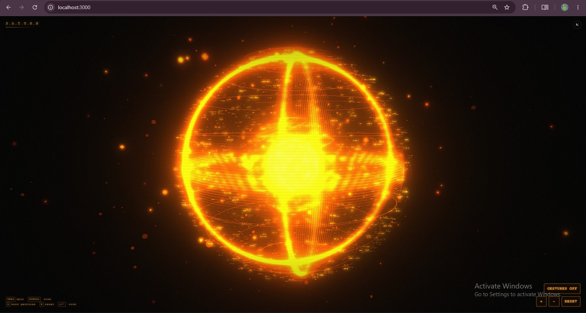

# 🪐 Saturn-AI

> 🚧 **Status:** Active Development

> A modular voice-first AI assistant featuring a real-time holographic orb inspired by the elegance and symbolism of Saturn.



---

## ✨ Features

### Interface

- 🌌 Interactive 3D holographic orb
- 🖐️ Hand gesture controls

### AI

- 🧠 Gemini-powered reasoning
- 🎭 Custom Saturn personality
- 🧩 Brain state management
- 💬 Conversation pipeline

### Voice

- 🎤 Speech recognition
- 🗣️ Speech synthesis

### Architecture

- ⚡ Modular AI provider
- 🏗️ Next.js + TypeScript

---

## 🚀 Getting Started

Clone the repository

```bash
git clone https://github.com/Iba721/Saturn-AI.git
cd Saturn-AI
```

Install dependencies

```bash
npm install
```

Create a `.env.local` file

```env
SATURN_GEMINI_API_KEY=YOUR_API_KEY
SATURN_MODEL=gemini-3.6-flash
```

Run the development server

```bash
npm run dev
```

Open: <http://localhost:3000>

> ⚠️ Never commit your `.env.local` file or expose your Gemini API key publicly.

---

## 🏗️ Project Structure

```
app/
components/
hooks/
│   ├── useVoice.ts
│   └── useSpeech.ts
│
lib/
│   ├── api.ts
│   └── orbScene.ts
│
server/
│   ├── ai/
│   │   ├── gemini.ts
│   │   ├── provider.ts
│   │   └── index.ts
│   │
│   ├── prompts/
│   │   └── system.ts
│   │
│   ├── brain.ts
│   ├── conversation.ts
│   ├── memory.ts
│   ├── planner.ts
│   └── tools.ts
```

---

## 🛠 Tech Stack

| Technology | Purpose |
|------------|---------|
| Next.js | Framework |
| React | UI |
| TypeScript | Type Safety |
| Three.js | 3D Rendering |
| MediaPipe | Hand Tracking |
| Gemini | AI Reasoning |
| Web Speech API | Voice Recognition & Speech |

---

## 🪐 Vision

Saturn-AI is being developed as a modular assistant capable of naturally:

- 🎤 Listening
- 🗣 Speaking
- 🧠 Remembering
- 👁 Understanding visual input
- 📱 Controlling Android devices
- 📋 Planning complex tasks

The goal is to create an extensible open-source assistant that feels natural to interact with while remaining easy for developers to expand.

---

## 🛣️ Roadmap

## ✅ Current Capabilities

- [x] 3D Orb
- [x] Hand Tracking
- [x] Voice Recognition
- [x] Speech Synthesis
- [x] Gemini Integration
- [x] Custom AI Personality
- [x] Brain State System

## 🚀 Planned Features

- [ ] Long-Term Memory
- [ ] Android Device Control
- [ ] Tool Calling
- [ ] Vision Support
- [ ] Wake Word Detection
- [ ] Autonomous Planning

---

## 📦 Requirements

- Node.js 20+
- npm
- Google Gemini API Key
- Webcam (for gesture tracking)
- Microphone (for voice interaction)

---

## 🙏 Credits

Saturn-AI is based on the open-source **Ultron AI** project by **SAGAR-TAMANG**, licensed under the MIT License.

Original Repository:

https://github.com/SAGAR-TAMANG/ultron-by-sagar-builds

Saturn-AI significantly extends the original project with:

- Voice assistant architecture
- Gemini integration
- Modular AI provider
- Custom Saturn personality
- Brain state system
- Conversation pipeline
- Speech recognition
- Speech synthesis
- Project restructuring

The original MIT License is preserved in accordance with its terms.

---

## 🤝 Contributing

Contributions, bug reports, feature requests, and discussions are welcome.

If you'd like to contribute, please open an issue before making significant architectural changes.

---

## Disclaimer

Saturn-AI is an independent open-source project.

It is inspired by futuristic AI assistants but is not affiliated with Marvel, Disney, Iron Man, or J.A.R.V.I.S.

---

## 📜 License

This project is distributed under the MIT License.

The original copyright notice and license are retained as required by the MIT License.